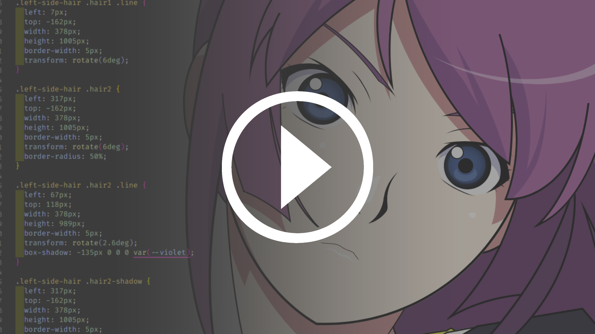

# Senjougahara Hitagi

I draw (or trace) anime girl using HTML and CSS only.

## Live Website

[hitagi.gpr.wtf](https://hitagi.gpr.wtf)

## Video

Short documentation process when I made this project.

[Alternate video with bakemonogatari soundtrack.](https://drive.google.com/file/d/1pWBHvHG3ba5GsdHoUfMLhwjoqMWhfVGT/view?usp=sharing)

## Original Image

_Note : I can't find the original artist. If anyone knows the original artist, let me know via issue or create a PR._

## Contribute

Everyone who wants to contribute are welcome. You can refactor the code, make the drawing better, or anything. Just create pull request and I will review it.

_Somebody please fix the mouth, It's very ugly now, hehe._

## Useful Links & Supporting Tools

- [Photopea](https://www.photopea.com/)
- [Fancy Border Radius](https://9elements.github.io/fancy-border-radius/full-control.html)
- <https://dev.to/alvaromontoro/drawing-homer-simpson-using-circles-in-css-4gc1>
- <https://github.com/alvaromontoro/CSS-Simpsons>
- <https://pattle.github.io/simpsons-in-css>
- <https://github.com/pattle/simpsons-in-css>
